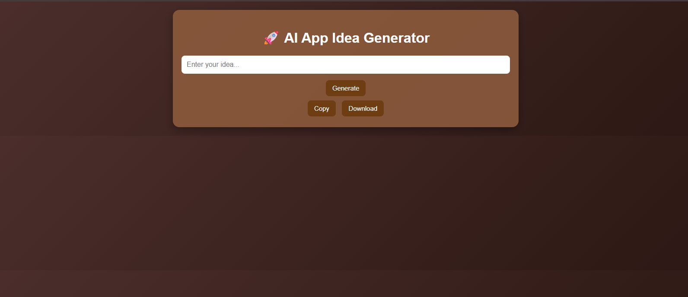
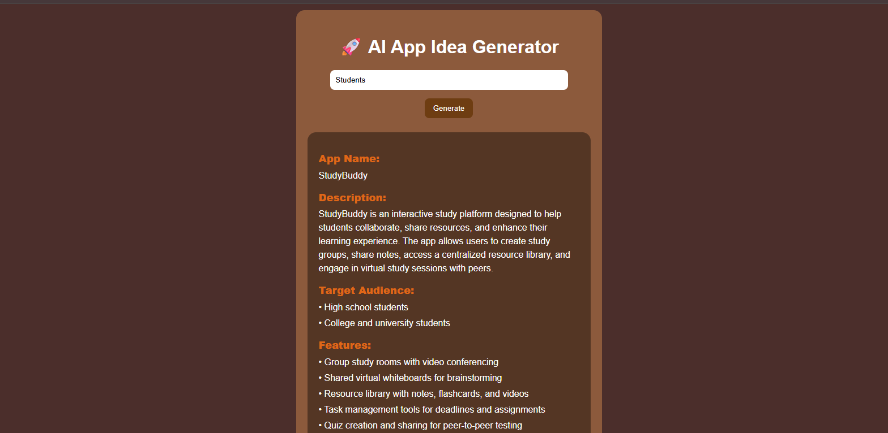

# 🚀 AI App Idea Generator

 An AI-powered web app that instantly generates complete, structured startup ideas  built for developers, founders, and dreamers.

---

## 🌐 Live Demo
[Demo](https://ai-app-idea-generator-steel.vercel.app/)

---

## 📸 Preview




---

## ✨ Features

- 🤖 AI-powered idea generation  
- 📊 Structured output (App Name, Description, Features, Monetization, Tech Stack)  
- ⏳ Loading spinner + typing animation  
- 📱 Responsive design  
- 📋 Copy to clipboard  
- 📄 Download idea  

---
 
## 🛠️ Tech Stack
 
### Frontend


 
### Backend


 
### AI & Deployment


 
---
 
## 📂 Project Structure
 
```
ai-app-idea-generator/
│
├── public/               # Frontend assets
│   ├── style.css
│   └── script.js
│
├── views/                # EJS templates
│   └── index.ejs
│
├── server.js             # Express backend + API logic
├── .env                  # API keys (not committed)
├── package.json
└── README.md
```
 
---
 
## ⚙️ How It Works
 
```
User enters idea
      ↓
Frontend sends POST request
      ↓
Express backend receives it
      ↓
OpenRouter AI processes the prompt
      ↓
Structured idea returned
      ↓
UI displays with typing animation ✨
```
 
---


 
## 🔐 Environment Variables
 
Create a `.env` file in the root directory:
 
```env
OPENROUTER_API_KEY=your_api_key_here
PORT=3000
```

---
 
## 📦 Installation & Setup
 
```bash
# 1. Clone the repository
git clone https://github.com/ifra489/ai-app-idea-generator
 
# 2. Navigate into the project
cd ai-app-idea-generator
 
# 3. Install dependencies
npm install
 
# 4. Add your API key to .env
echo "OPENROUTER_API_KEY=your_key_here" > .env
 
# 5. Start the server
node server.js
```
 
Then open `http://localhost:3000` in your browser.
 
---

## 🌟 Future Improvements

- Dark mode  
- Save ideas  
- Login system  
- Share feature  

---
 
## 👩‍💻 Author
 
**Ifra Malik** 
 
[](https://github.com/ifra489)
 
---
 
## 📜 License
 
This project is open-source and free to use under the [MIT License](LICENSE).
 
---
 
<p align="center">Made with ❤️ by Ifra · If you found this useful, give it a ⭐</p>


